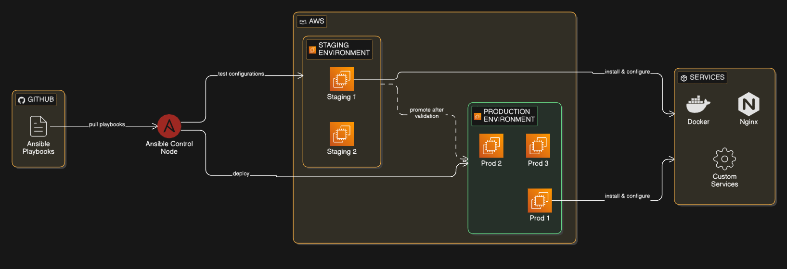

# 🚀 Infrastructure Automation Using Ansible on AWS EC2



---

## 📌 Project Overview

This project demonstrates **Infrastructure as Code (IaC)** using **Ansible** to automate provisioning and configuration of services on **AWS EC2** instances.

The objective of this project is to eliminate manual server configuration and implement a scalable, reusable automation framework using DevOps best practices.

---

## 🏗️ Architecture

**Control Node:** Ansible  
**Managed Node:** AWS EC2 (Ubuntu Linux)  
**Services Deployed:**  
- Nginx Web Server  
- Docker Engine  
- Nginx Docker Container  

### Workflow:

Ansible Control Node  
        ↓ (SSH)  
AWS EC2 Instance  
        ↓  
Install & Configure Services  
        ↓  
Deploy Dockerized Application  

---

## 🛠️ Technologies Used

- Ansible
- AWS EC2
- Ubuntu Linux
- Docker
- Nginx
- Git
- GitHub

---

## 📂 Project Structure

```

ansible-infrastructure-automation/
│── ansible.cfg
│── site.yml
│── inventory/
│   ├── staging
│   └── production
│── roles/
│   ├── nginx/
│   │   ├── tasks/
│   │   ├── handlers/
│   │   ├── defaults/
│   │   └── vars/
│   └── docker/
│       ├── tasks/
│       ├── handlers/
│       ├── defaults/
│       └── vars/
│── Infrastructure Automation Using Ansible.png
│── README.md

````

---

## ⚙️ Key Features Implemented

✔ Role-based modular Ansible architecture  
✔ Automated Nginx installation & configuration  
✔ Automated Docker installation & configuration  
✔ Docker container deployment via Ansible  
✔ Separate inventory for staging & production  
✔ Idempotent playbook execution  
✔ Infrastructure as Code principles  
✔ Version controlled using Git  

---

## ▶️ Setup & Execution Guide

### 1️⃣ Launch AWS EC2 Instance
- Ubuntu AMI
- Open ports: 22, 80, 8080
- Configure Security Group

---

### 2️⃣ Install Ansible on Control Node

```bash
sudo apt update
sudo apt install ansible -y
````

---

### 3️⃣ Configure Inventory

Edit:

```
inventory/staging
```

Add:

```
[web]
<EC2_PUBLIC_IP> ansible_user=ubuntu ansible_ssh_private_key_file=~/.ssh/your-key.pem
```

---

### 4️⃣ Run Playbook

```bash
ansible-playbook site.yml
```

---

## 🌐 Verification

After successful execution:

### Nginx Web Server:

```
http://<EC2-PUBLIC-IP>
```

### Docker Nginx Container:

```
http://<EC2-PUBLIC-IP>:8080
```

---

## 🎯 Project Outcomes

* Reduced manual configuration time
* Improved deployment consistency
* Implemented reusable automation framework
* Applied Infrastructure as Code best practices
* Demonstrated real-world DevOps workflow

---

## 📚 DevOps Concepts Demonstrated

* Configuration Management
* Infrastructure as Code (IaC)
* Automation
* Role-Based Architecture
* Environment Segregation
* Containerization
* Cloud Deployment
* Version Control

---

## 🚧 Challenges Faced

* SSH key configuration issues
* Docker permission management
* GitHub authentication using Personal Access Token
* Security group configuration for exposed ports

---

## 🔮 Future Enhancements

* Integrate Terraform for infrastructure provisioning
* Add CI/CD pipeline using GitHub Actions
* Deploy real application instead of default Nginx
* Add monitoring using Prometheus & Grafana
* Implement auto-scaling setup

---

## 👨‍💻 Author

**Govind Hede**
DevOps Engineer | Cloud & Automation Enthusiast

---


